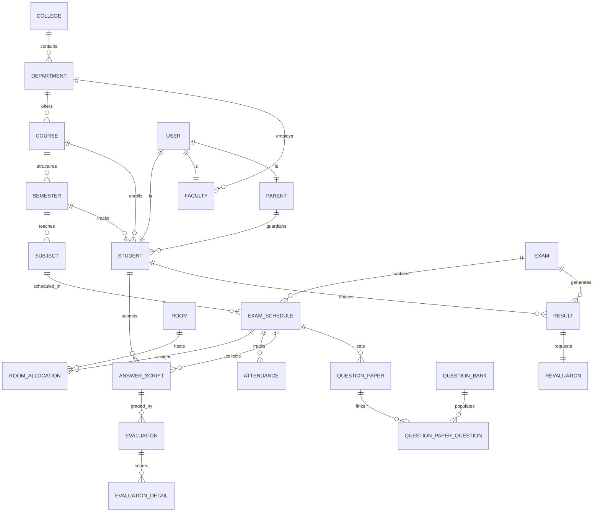

# Database Design - Smart Examination Management Platform

This document describes the database design for the Smart Examination Management and Evaluation Automation Platform, normalized to 3rd Normal Form (3NF) to ensure data integrity, performance, and security.

---

## 1. Entity Relationship Overview

The platform uses a role-based multi-tenant architecture designed around `User` entities, `Profiles` (Student, Faculty, Parent), `Academic Structure` (College, Department, Course, Subject, Academic Year, Semester), and `Examination Modules` (Exams, Schedules, Allocations, Attendance, Question Papers, Evaluation, and Results).

---

## 2. Key Database Constraints & Cascade Rules

### Cascade Rules:
*   **Users & Profiles**: Deleting a `User` cascades to delete their `Student`, `Faculty`, or `Parent` profiles (`onDelete: Cascade`).
*   **Academic Hierarchy**: Deleting a `College` cascades to `Department` -> `Course` -> `Semester` -> `Subject`.
*   **Student Enrolment**: Deleting a `Student` cascades to clean up their results, schedules, room allocations, and attendance records.
*   **Evaluations**: Deleting an `Evaluation` cascades to delete all itemized `EvaluationDetail` rows.
*   **Exam Schedules**: Deleting an `ExamSchedule` cascades to room allocations, attendances, and associated results.

### Unique Constraints:
*   `User.email`: Must be unique for credentials.
*   `College.code`, `Department.code`, `Course.code`, `Subject.code`: Unique academic identifiers.
*   `Student.rollNumber` and `Student.registrationNumber`: Unique student identifiers.
*   `RoomAllocation([examScheduleId, studentId])`: A student can only sit in one seat per exam.
*   `RoomAllocation([examScheduleId, roomId, seatNumber])`: A seat cannot be double-allocated for the same exam schedule.
*   `Result([studentId, subjectId, examId])`: A student can only have one result set per exam per subject.
*   `ResultSummary([studentId, semesterId])`: Unique GPA/CGPA summary per semester.

---

## 3. Indexing Strategy for Query Performance

To ensure database scaling up to hundreds of thousands of students and schedules:
*   **Composite Index on `Result(studentId, examId)`**: Speeds up transcript and grade generation queries.
*   **Index on `User(email)`**: Speeds up authentication lookups.
*   **Index on `User(role)`**: Speeds up list filters by admin/faculty/student role.
*   **Index on `Student(rollNumber)` and `Student(registrationNumber)`**: Fast dashboard searches.
*   **Index on `AnswerScript(barcodeNumber)`**: Instant script validation via barcode scanners.
*   **Index on `ExamSchedule(examId, date)`**: Accelerates exam timetable loading.
